<h1>Compte rendu de l'activité Pratique N° 2 : ORM JPA HIbernate Spring Data Exemple de produit  </h1>
Grami salma 
<h3>Introduction</h3>

Dans ce TP, nous explorerons les fondamentaux 
de Spring Boot et l'utilisation de JPA Repository dans 
le développement d'applications Java. Spring Boot est un framework 
facilitant la création d'applications Java autonomes et basées 
sur des microservices, tandis que JPA (Java Persistence API) 
Repository offre une interface de haut niveau pour interagir 
avec la couche  des données dans une application Java.

 
<h3>Enonce</h3>
1. Installer IntelliJ Ultimate 
2. Créer un projet Spring Initializer avec les dépendances JPA, H2, Spring Web et Lombock 
3. Créer l'entité JPA Product ayant les attributs : 
   - id de type Long 
   - name de type String 
   - price de type double 
   - quantity de type int 
4. Configurer l'unité de persistance dans le ficher application.properties 
5. Créer l'interface JPA Repository basée sur Spring data 
6. Tester quelques opérations de gestion de patients : 
    - Ajouter des produits 
    - Consulter tous les produits 
    - Consulter un produit 
    - Chercher des produits 
    - Mettre à jour un produit 
    - supprimer un produit 
7. Migrer de H2 Database vers MySQL 

<h3>Conception</h3>
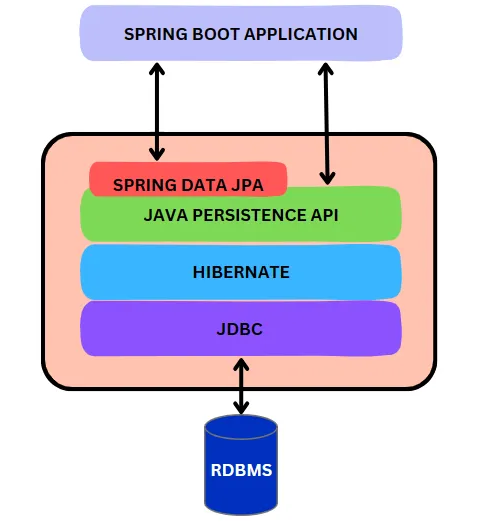

 

<h3>Captures ecran </h3>

Créer l'entité JPA Product dans H2 

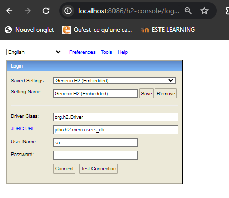
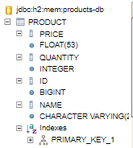
 
 
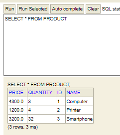

H2 Database est une base de données temporaire souvent utilisée 
pour les tests, où les données peuvent être ajoutées et manipulées 
pendant la session, mais sont supprimées une fois la connexion terminée.
L'accès à la base de données se fait via le lien localhost/h2-console. 

 
 

Tester quelques opérations de gestion de patients :

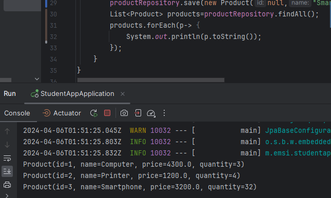
 
 

JPA offre les CRUD par défaut avec quelques
opérations de filtrage de base de données, mais il faut respecter 
le nom de la méthode, ce qui s'avère difficile pour les filtrages complexes. 
Voici un exemple d'utilisation
de findAll dans ProductRepository qui hérite de JpaRepository.

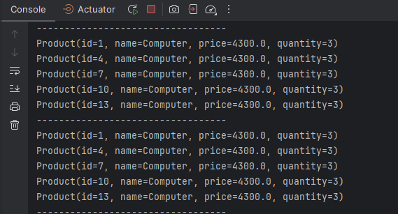
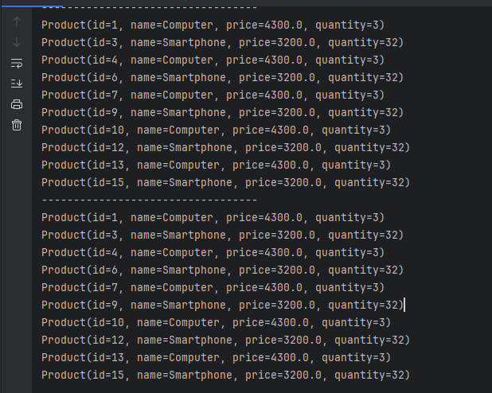

Pour surmonter la difficulté de savoir
exactement la méthode de JPA, nous pouvons créer notre propre méthode avec 
notre propre nom en utilisant le langage HQL et l'annotation @Query.
Cela nous permet d'obtenir
le même résultat comparé à l'utilisation de la méthode JPA conventionnelle. 

 
 

Migrer de H2 Database vers MySQL

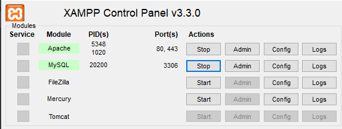
 
 
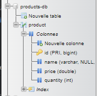
 
 
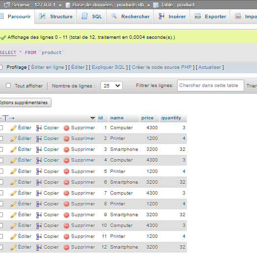

Pour migrer vers MySQL, nous utilisons XAMPP, un ensemble d'outils qui comprend Apache, MySQL, PHP et Perl. Après avoir installé XAMPP, nous modifions le fichier properties de notre application pour configurer l'accès à MySQL en spécifiant le nom de l'hôte, le port, le nom de la base de données, ainsi que le nom d'utilisateur et le mot de passe associés. Une fois la configuration terminée, nous pouvons commencer à utiliser MySQL comme base de données pour notre application.

 
 

Créer le web service 

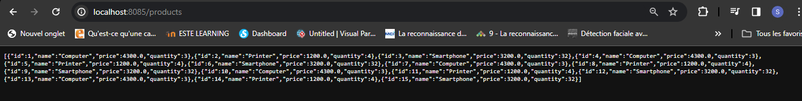
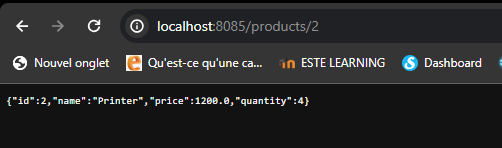

Nous pouvons également créer un web service pour visualiser les données en utilisant @RestController. En annotant notre classe avec @RestController, nous accédons à nos données au format JSON. En spécifiant l'URL d'accès avec @GetMapping, nous définissons les points d'accès à nos ressources. De plus, en utilisant @PathVariable, nous pouvons accéder à un objet spécifique en passant des paramètres dans l'URL. Cette approche nous permet de fournir une interface web pour interagir avec nos données de manière simple et efficace.

<h3>Conclusion</h3>

Ce TP a été une étape importante dans
notre parcours d'apprentissage et nous sommes prêts à explorer davantage les possibilités offertes par 
ces technologies dans nos projets futurs.
